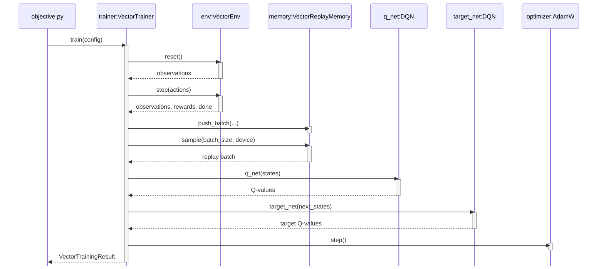

```mermaid
%%{init: {"sequence": {"mirrorActors": false}}}%%
sequenceDiagram
    participant caller as objective.py
    participant trainer as trainer:VectorTrainer
    participant env as env:VectorEnv
    participant memory as memory:VectorReplayMemory
    participant q_net as q_net:DQN
    participant target_net as target_net:DQN
    participant optimizer as optimizer:AdamW

    caller->>trainer: train(config)
    activate trainer
    trainer->>env: reset()
    activate env
    env-->>trainer: observations
    deactivate env

    trainer->>env: step(actions)
    activate env
    env-->>trainer: observations, rewards, done
    deactivate env
    trainer->>memory: push_batch(...)
    activate memory
    deactivate memory

    trainer->>memory: sample(batch_size, device)
    activate memory
    memory-->>trainer: replay batch
    deactivate memory
    trainer->>q_net: q_net(states)
    activate q_net
    q_net-->>trainer: Q-values
    deactivate q_net
    trainer->>target_net: target_net(next_states)
    activate target_net
    target_net-->>trainer: target Q-values
    deactivate target_net
    trainer->>optimizer: step()
    activate optimizer
    deactivate optimizer

    trainer-->>caller: VectorTrainingResult
    deactivate trainer
```
