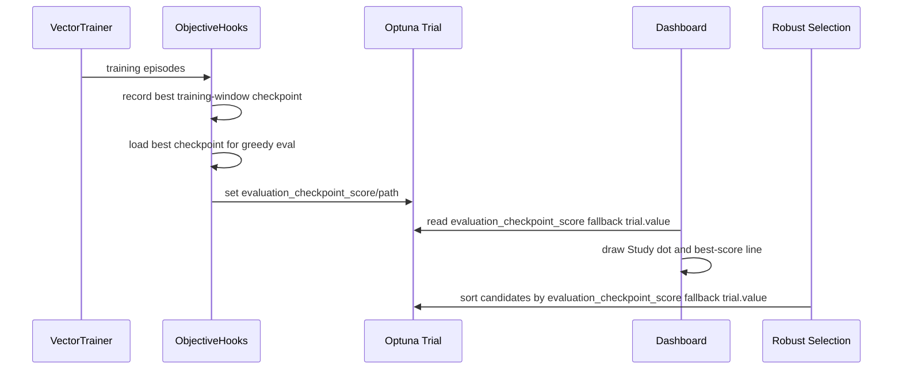

# BI11 Design: Score Trials By Their Best Checkpoint

Status: implemented; verify behavior in the next Colab run.

Goal: the Study plot and candidate selection should score the concrete best checkpoint produced by a trial, not an accidental final model state.

## Current State

- The Current Trial Training plot gets `best_checkpoint_score` from `ObjectiveHooks.best_checkpoint_score`; this is only a live reference line.
- `ObjectiveHooks.q_net_for_evaluation(ctx)` already loads the best training-window checkpoint before greedy evaluation when such a checkpoint exists.
- `ObjectiveHooks.finalize_trial(ctx)` stores `evaluation_checkpoint_score` and `evaluation_checkpoint_path` after evaluation.
- The Study plot currently uses `trial.value` in `_current_study_points(...)`.
- Robust candidate selection currently sorts complete trials by `trial.value`.

So there is no real "plot-to-plot transfer" yet. The durable source is the trial attrs written by the hook.

## KISS Plan

Add one small helper, for example in `hpo.checkpointing`:

```python
def trial_best_checkpoint_score(trial) -> float:
    return float(trial.user_attrs.get("evaluation_checkpoint_score", trial.value))
```

Use it in two places:

- Dashboard Study plot: `_current_study_points(...)` uses `trial_best_checkpoint_score(trial)` for the dot and red incumbent line.
- Robust selection: `_top_complete_trials(...)` sorts by `trial_best_checkpoint_score(trial)`.

Keep fallbacks to `trial.value` for old DBs and trials without evaluation checkpoint attrs.

## Sequence

See also: [PlantUML sequence diagram](design_bi11.puml).



## Why This Is Small

`objective.py` stays as it is. The hook already writes the checkpoint attrs; BI11 only makes the Study plot and robust candidate ranking read the right score. Later BI14 can build on the same attrs to evaluate concrete checkpoint files more deeply.
