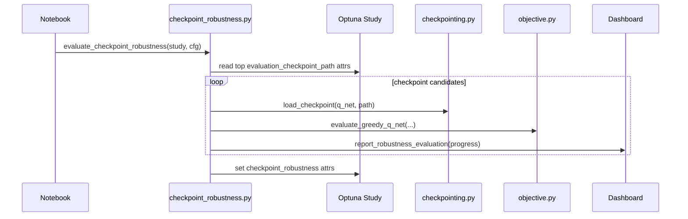

# BI14 Design: Checkpoint Robustness Evaluation

Goal: evaluate concrete saved pilots, not only HP sets that may or may not reproduce a good pilot.

## Current State

- HP Robustness Evaluation keeps its current meaning: candidate = HP set, extra points = fresh trainings with extra seeds.
- BI11 now makes the Study plot and HP candidate ranking use `evaluation_checkpoint_score`.
- Saved `*_eval_best.pt` checkpoints contain model weights and metadata.
- `load_checkpoint(...)` and `evaluate_greedy_q_net(...)` already exist.
- The dashboard robustness panel only needs `candidate_seed_scores`; it does not fundamentally care whether a candidate is an HP set or a checkpoint.

## KISS Plan

Add a separate checkpoint robustness path, not a new mode inside `StudyRunner.run(...)` yet.

Possible API:

```python
evaluate_checkpoint_robustness(
    study,
    objective_cfg,
    top_n=5,
    eval_episodes=20,
    progress_fn=reporter.report_robustness_evaluation,
)
```

Behavior:

- Select top `*_eval_best.pt` checkpoints from the study.
- For each checkpoint candidate:
  - load the Q-net weights
  - run greedy evaluation with more episodes/seeds
  - append scores to `candidate_seed_scores`
  - report progress through the existing robustness panel
- Store results in study attrs, for example `checkpoint_robustness`.

## Dashboard Reuse

Use the same panel shape:

- x-axis: candidate
- y-axis: score
- points: repeated greedy evaluations of this concrete checkpoint
- red diamond: mean score per checkpoint

Only the title should change from `HP Robustness Evaluation` to `Checkpoint Robustness Evaluation`.

## Sequence



## Open Points

- Q-net construction is solved cleanly by a small helper: build `DQN(n_observations, n_actions)` from an evaluation env, then use the existing `hpo.checkpointing.load_checkpoint(q_net, path, device)`.
- Should scores be one point per world, per seed, or aggregated per eval batch? First KISS version can use the same aggregate score shape as HP robustness.
- Keep HP Robustness Evaluation unchanged until Checkpoint Robustness proves useful.

Sketch:

```python
env = make_env()
try:
    observation, _ = env.reset()
    q_net = DQN(math.prod(observation.shape), env.action_space.n).to(device)
    load_checkpoint(q_net, checkpoint_path, device)
finally:
    env.close()
```
