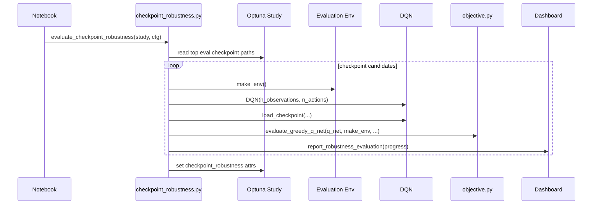

# BI14 Design V2: Checkpoint Robustness Evaluation

Status: implemented; verify behavior in the next Colab run.

Goal: evaluate concrete saved pilots. HP Robustness asks whether HPs can produce good pilots; Checkpoint Robustness asks whether this saved pilot is actually good.

## Module

Add a focused module:

```text
hpo/checkpoint_robustness.py
```

This keeps `study.py` and `StudyRunner.run(...)` unchanged and avoids mixing checkpoint evaluation into HP robustness.

## Core API

```python
evaluate_checkpoint_robustness(
    study,
    objective_cfg,
    top_n=5,
    eval_episodes=20,
    progress_fn=None,
)
```

KISS behavior:

- Select top `*_eval_best.pt` checkpoint candidates from the study.
- For each checkpoint:
  - start with its existing `evaluation_checkpoint_score` as source score
  - build a fresh `q_net` from the evaluation env dimensions
  - load the checkpoint with existing `hpo.checkpointing.load_checkpoint(...)`
  - evaluate greedily with `evaluate_greedy_q_net(...)`
  - report scores through the existing `RobustnessProgress`
- Store results in `study.user_attrs["checkpoint_robustness"]`.

## Q-Net Loading

No trainer-as-factory trick. Build the DQN directly from the env:

```python
env = make_env()
try:
    observation, _ = env.reset()
    q_net = DQN(math.prod(observation.shape), env.action_space.n).to(device)
    load_checkpoint(q_net, checkpoint_path, device)
finally:
    env.close()
```

This is the missing clean helper and can later be reused/refactored into a smaller shared function.

## Dashboard Reuse

Reuse the existing robustness panel shape:

- x-axis: checkpoint candidate
- y-axis: score
- points: source checkpoint score plus robust greedy evaluation score
- red diamond: mean score

Only the title should become `Checkpoint Robustness Evaluation`. The panel does not need to know whether a candidate is an HP set or a checkpoint.

## Sequence



## First Implementation Scope

- No `StudyRunner.run(...)` parameter.
- No replacement of HP Robustness.
- No new dashboard panel; reuse the existing one.
- Keep one robust eval score per checkpoint first; add per-world detail later only if needed.
