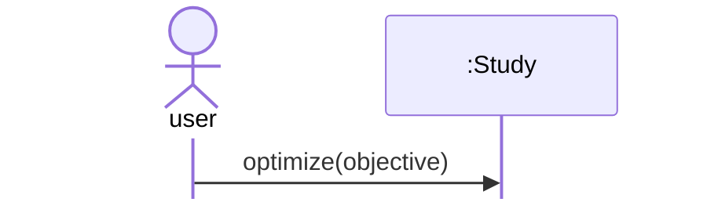

## Basic Optuna workflow

Optuna is a Python package for automated hyperparameter (HP) optimization.

Optuna is used like this:
- Define a function `objective(trial)` 
- Create a `study` and call `optimize(objective, n_trials)`
- Evaluate the trials, i.e. get the best HP combination

### UML diagram



### Python code

```python
import optuna

def objective(trial):
    # ...
    return score

study = optuna.create_study()

study.optimize(objective, n_trials=20)
```

What does `objective` do? 

`objective(trial)`
- calls `trial` to suggest HP values
- example: `trial.suggest_float("lr", 0.001, 0.01)`
- trains the model with these HP values
- scores the model
- returns the `score`

What does `optimize` do? For `n_trials` times, it
- creates a `trial`
- calls `objective(trial)`
- suggests HP values when `objective` calls `trial.suggest_*`
- stores `(hp_values, score)`

### Essence

Define the `objective` -> create a `study` -> run `study.optimize(...)` -> evaluate the trials.


## Lunar Lander HPO design

Coming soon.
