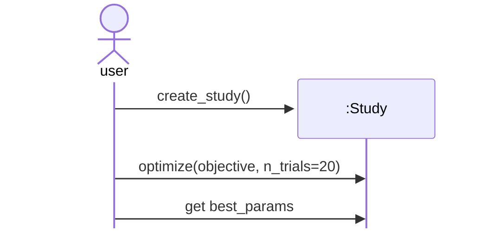

## Basic Optuna workflow

Optuna is a Python package for automated hyperparameter (HP) optimization.

Optuna is used like this:
- Define a function `objective(trial)` 
- Create a `study` and call `optimize(objective, n_trials)`
- Evaluate the trials, i.e. get the best HPs

### As UML diagram

After defining the `objective` function, use Optuna like this:



### As Python code

```python
import optuna

def objective(trial):
    # ... (It's the user's job to define this function.)
    return score

# Now the user can push the Optuna button, so to speak, to get the best HP values:
study = optuna.create_study()
study.optimize(objective, n_trials=20)

best_params = study.best_params
print(best_params)
```

***What does `objective` do?***

`objective(trial)`:
- call `trial.suggest_*` to get HP suggestions
- train the model with these HP values
- score the model
- return the `score`

Example: `trial.suggest_float("lr", 1e-4, 1e-3)`

Under the hood: In order to suggest an HP value, trial
- asks study.sampler for a value
- stores the suggested value in the trial/study storage
- returns the value to objective


***What does `optimize` do?***

`optimize(objective, n_trials)`: For `n_trials` times:
- create a `trial`
- call `objective(trial)`
- suggest HP values when `objective` calls `trial.suggest_*`  # remove?
- store `(hp_values, score)`

### Essence

Define the `objective` -> create a `study` -> run `study.optimize(...)` -> evaluate the trials.

### Links

[Simple example](https://optuna.readthedocs.io/en/stable/tutorial/10_key_features/001_first.html) in the Optuna tutorial.


## Lunar Lander HPO design

### Gegeben

#### Training

> Mean score verläuft manchmal V-förmig über den Episoden eines Trainings.

Training = Ausführung von trainer.train(...) (dauert ca. 3 min).

> Während des Trainings ändert sich epsilon.

epsilon = Explorationsrate

#### Optuna

> objective(trial):
> - ruft trainer.train(...) 1x auf  
> - speichert in trial Infos: Bestes mean score Fenster u. a.

> Am Ende einer Studie: Mit study.best_trial kommt man an die Infos vom besten Trial. 

#### Hyperparameter

Das sind die HPO-relevanten Hyperparameter für den VectorTrainer:
- learning_rate
- batch_size
- eps_end
- eps_decay
- gamma
- tau
- learning_starts
- optimize_every
- replay_memory_capacity

Nicht in der VectorTrainer-HPO:
- num_episodes ist das Trial-Budget, kein HP.
- double_dqn gibt es nur beim TunedTrainer.

### Ansatz

#### Studien

Studie 0: Baseline festlegen  
Das ist kein echter HPO-Lauf, eher Referenz.

Dann:
> Mehrere Studien mit je ca. 20 bis 40 Trials
> - Zeitbedarf: Studie mit 40 Trials dauert 2 h (40 * 3 min)
> - Optuna findet in jeder Studie mittels TPE die besten Werte für ausgewählt HPs
> - Welche HPs in welchen Bereichen optimiert werden: Das wird ***SearchSpace*** festgelegt (siehe HPO-Notebook).

### Definition der Studien

Die Studien laufen mit dem VectorTrainer auf Colab Pro / L4.

Bei 3 min pro Trial ergeben 120 HPO-Trials ca. 6 h GPU-Zeit,
plus Robustheitsprüfungen:

| Studie | Ziel | Trials |
|---|---|---:|
| S1 Update-Ökonomie | Lernrate, Batch-Größe und Update-Frequenz grob einstellen | 40 |
| S2 Exploration | Epsilon-Kurve einstellen | 40 |
| S3 Replay-Kapazität | Prüfen, ob der Replay-Speicher groß genug ist | 10 |
| S4 Gemeinsame Feinsuche | Wichtigste Gewinner zusammen eng nachoptimieren | 30 |

#### Suchräume in den Studien

| HP | S1 Update-Ökonomie | S2 Exploration | S3 Replay-Kapazität | S4 Gemeinsame Feinsuche |
|---|---|---|---|---|
| learning_rate | *float(1e-4, 1e-3, log=True)* | best(S1) | best(S1) | *float(best / 2, best * 2, log=True)* |
| batch_size | *categorical([512, 1024, 2048])* | best(S1) | best(S1) | *categorical(neighbors(best(S1), [512, 1024, 2048]))* |
| eps_end | 0.05 | *float(0.01, 0.10)* | best(S2) | *float(max(0.01, best - 0.02), min(0.10, best + 0.02))* |
| eps_decay | 50_000 | *int(20_000, 150_000, log=True)* | best(S2) | *int(best / 2, best * 2, log=True)* |
| gamma | 0.99 | 0.99 | 0.99 | 0.99 |
| tau | 0.005 | 0.005 | 0.005 | 0.005 |
| learning_starts | *categorical([2_500, 5_000, 10_000, 20_000])* | best(S1) | best(S1) | *categorical(neighbors(best(S1), [2_500, 5_000, 10_000, 20_000]))* |
| optimize_every | *categorical([2, 4, 8])* | best(S1) | best(S1) | *categorical(neighbors(best(S1), [2, 4, 8]))* |
| replay_memory_capacity | 200_000 | 200_000 | *categorical([50_000, 100_000, 200_000, 500_000])* | best(S3) |

Notation:
- *kursiv*: Wert wird in dieser Studie von Optuna gewählt.
- ohne Markierung: Wert bleibt fest oder wird aus einer vorherigen Studie übernommen.
- float, int, categorical stehen für `trial.suggest_float`, `trial.suggest_int`, `trial.suggest_categorical`.
- best(Sx): bester Wert aus Studie x.
- neighbors(b, M): b plus direkte Nachbarn in Menge M.

#### Robustheit

##### Scoring und Fenstergröße

Der Score eines Trials werde in `objective` so definiert:

> objective_score = (best_window_score + final_window_score) / 2

Ausführlicher als Python-Snippet:

```python
best_window = best_window_mean(result.episode_returns, score_window)
best_window_score = best_window.mean
final_returns = result.episode_returns[-score_window:]
final_window_score = sum(final_returns) / len(final_returns)
objective_score = (best_window_score + final_window_score) / 2

trial.set_user_attr("best_window_score", best_window_score)
trial.set_user_attr("final_window_score", final_window_score)
trial.set_user_attr("objective_score", objective_score)
return objective_score
```

Das score_window darf nicht zu klein sein. Ein Training dauert 600 Episoden. Es sei (für best_window_score und final_window_score):

> score_window = 100


##### Bestätigung der besten HP-Kombination vor Studienübergang

Trainingsergebnisse im RL weisen zufällige Schwankungen auf. Die scheinbar beste HP-Kombination kann mit anderem Seed deutlich schlechter abschneiden.

Daher werden die 3 besten HP-Kombinationen vor Studienübergang mit je 2 anderen Seeds erneut geprüft.
Als beste HP-Kombination gilt am Ende die mit dem besten Mittelwert.


##### Abschlussprüfung

Nach den vier Studien werden die besten 3 HP-Kombinationen mit mehreren
Seeds bestätigt. Diese Bestätigung ist keine weitere HPO-Studie, sondern eine
abschließende Robustheitsprüfung gegen RL-Zufall.
