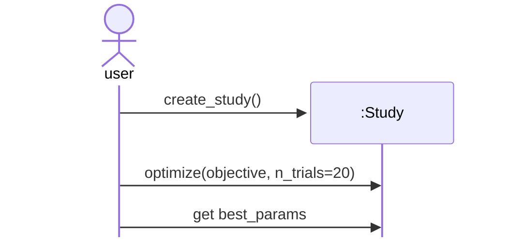

## Basic Optuna workflow

Optuna is a Python package for automated hyperparameter (HP) optimization.

Optuna is used like this:
- Define a function `objective(trial)` 
- Create a `study` and call `optimize(objective, n_trials)`
- Evaluate the trials, i.e. get the best HPs

### As UML diagram

After defining the `objective` function, use Optuna like this:



### As Python code

```python
import optuna

def objective(trial):
    # ... (It's the user's job to define this function.)
    return score

# Now the user can push the Optuna button, so to speak, to get the best HP values:
study = optuna.create_study()
study.optimize(objective, n_trials=20)

best_params = study.best_params
print(best_params)
```

***What does `objective` do?***

`objective(trial)`:
- call `trial.suggest_*` to get HP suggestions
- train the model with these HP values
- score the model
- return the `score`

Example: `trial.suggest_float("lr", 1e-4, 1e-3)`

Under the hood: In order to suggest an HP value, trial
- asks study.sampler for a value
- stores the suggested value in the trial/study storage
- returns the value to objective


***What does `optimize` do?***

`optimize(objective, n_trials)`: For `n_trials` times:
- create a `trial`
- call `objective(trial)`
- suggest HP values when `objective` calls `trial.suggest_*`  # remove?
- store `(hp_values, score)`

### Essence

Define the `objective` -> create a `study` -> run `study.optimize(...)` -> evaluate the trials.

### Links

[Simple example](https://optuna.readthedocs.io/en/stable/tutorial/10_key_features/001_first.html) in the Optuna tutorial.


## Lunar Lander HPO design

Coming soon.
