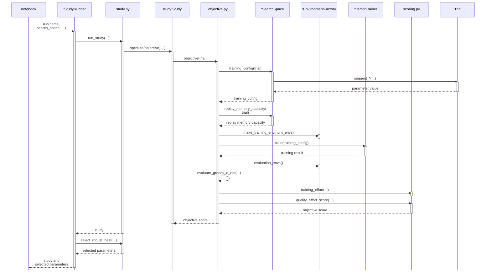

```mermaid
%%{init: {"sequence": {"mirrorActors": false}}}%%
sequenceDiagram
    participant notebook as notebook
    participant runner as :StudyRunner
    participant study_module as study.py
    participant study as study:Study
    participant objective as objective.py
    participant search_space as :SearchSpace
    participant environment_factory as :EnvironmentFactory
    participant trainer as :VectorTrainer
    participant scoring as scoring.py
    participant trial as :Trial


    notebook->>runner: run(name, <br/>search_space, ...)
    activate runner
    runner->>study_module: run_study(...)
    activate study_module

    study_module->>study: optimize(objective, ...)
    activate study
    study->>objective: objective(trial)
    activate objective
    objective->>search_space: training_config(trial)
    activate search_space
    search_space->>trial: suggest_*(...)
    activate trial
    trial-->>search_space: parameter value
    deactivate trial
    search_space-->>objective: training_config
    deactivate search_space
    objective->>search_space: replay_memory_capacity(<br/>trial)
    activate search_space
    search_space-->>objective: replay memory capacity
    deactivate search_space
    objective->>environment_factory: make_training_env(num_envs)
    activate environment_factory
    deactivate environment_factory
    objective->>trainer: train(training_config)
    activate trainer
    trainer-->>objective: training result
    deactivate trainer
    objective->>environment_factory: evaluation_envs()
    activate environment_factory
    deactivate environment_factory
    objective->>objective: evaluate_greedy_q_net(...)
    objective->>scoring: training_effort(...)
    activate scoring
    deactivate scoring
    objective->>scoring: quality_effort_score(...)
    activate scoring
    scoring-->>objective: objective score
    deactivate scoring
    objective-->>study: objective score
    deactivate objective
    deactivate study
    study_module-->>runner: study
    deactivate study_module

    runner->>study_module: select_robust_best(...)
    activate study_module
    study_module-->>runner: selected parameters
    deactivate study_module

    runner-->>notebook: study and <br/>selected parameters
    deactivate runner

```
