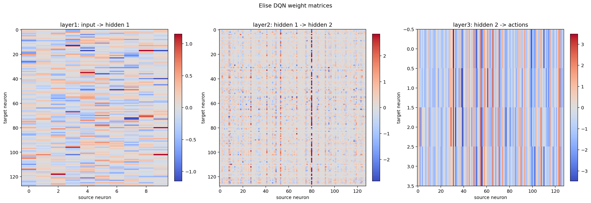
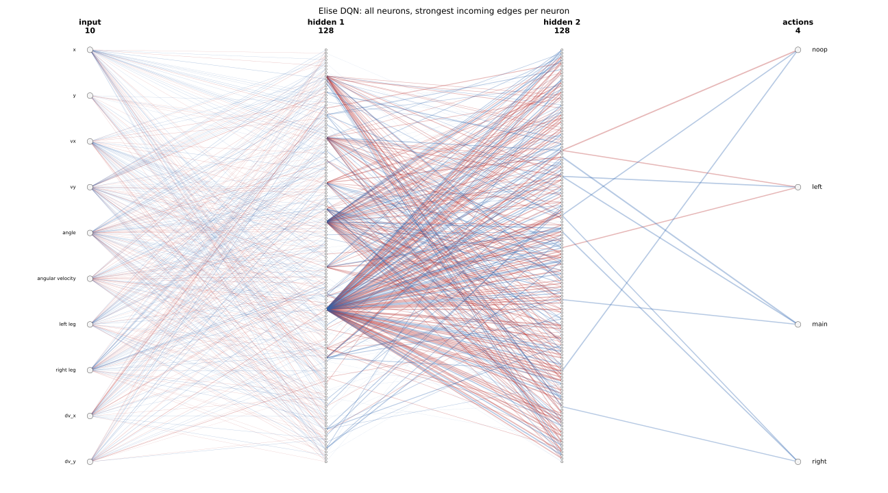

# HPO Hypotheses

Each hypothesis should stay attackable: what should happen if it is true, and what would make us update or drop it?

| Nr                                                                 | Hypothesis                                             | Topics                           |
| ------------------------------------------------------------------ | ------------------------------------------------------ | -------------------------------- |
| [[#H1 Earth Is Learnable\|H1]]                                     | Earth Is Learnable                                     | SSL                              |
| [[#H2 Hard Worlds Need Flight Hours\|H2]]                          | Hard Worlds Need Flight Hours                          | SSL                              |
| [[#H3 Sampling Should Favor Hard Worlds\|H3]]                      | Sampling Should Favor Hard Worlds                      | SSL, Sampling                    |
| [[#H4 Observation Mode Is Still Open\|H4]]                         | Observation Mode Is Still Open                         | SSL                              |
| [[#H5 Good HPs Are Not Enough\|H5]]                                | Good HPs Are Not Enough                                | RL, Checkpointing                |
| [[#H6 Ground Side-Thrust Penalty Can Recover Landing Rewards\|H6]] | Ground Side-Thrust Penalty Can Recover Landing Rewards | RL, SSL                          |
| [[#H7 Strong Turbulence Can Saturate The Action Channel\|H7]]      | Strong Turbulence Can Saturate The Action Channel      | RL, SSL                          |
| [[#H8 H1-80 Ist Das Wichtigste Neuron Im Netzwerk\|H8]]            | ~~H1-80 Ist Das Wichtigste Neuron Im Netzwerk~~        | RL, SSL, NN Viz, largely refuted |
| [[#H9 H1-80 Ist Ein Control-Urgency-Neuron\|H9]]                   | ~~H1-80 Ist Ein Control-Urgency-Neuron~~               | RL, SSL, NN Viz, largely refuted |
| [[#H10 H1-80 ist ein alter Low-G-Overcontrol-Guard\|H10]]          | H1-80 ist ein alter Low-G-Overcontrol-Guard            | RL, SSL, NN Viz                  |

Topics: `RL` = Reinforcement Learning, `SSL` = SolarSystemLander.

## H1 Earth Is Learnable

**These:** Earth is learnable with 9D observations and suitable HPs.

**Evidence:** The Earth-only `s7_exploration` found several trials above `200` Gym score, with the best observed optimize trial around `242` and the best preserved checkpoint around `206`. The useful HP region currently points to `num_episodes=1000`, `batch_size=512`, `eps_end~0.02..0.04`, and `eps_decay~31k..43k`. Evidence is still small, but the robustness plot suggests `learning_rate~7e-4..1e-3` may be more reliable than much higher values; the `4.5e-3` candidate reached a good optimize score but failed badly in robustness.

**Prediction:** Repeating Earth-only 9D studies near this HP region should keep producing `200+` pilots.

**Could be wrong if:** Further Earth-only runs near this region fail to reproduce `200+`, or the observed wins turn out to be mostly lucky seed outliers.

**Consequence:** Earth is not a physical no-go for the small DQN; the earlier five-world weakness likely comes from the training setup.

## H2 Hard Worlds Need Flight Hours

**These:** Hard worlds need many own training episodes.

**Evidence:** Strong Earth trials only reached high training level very late; `160+` mean over 100 episodes appeared around episode `900` or later in the best trusted runs.

**Prediction:** Giving Earth and Venus more own episodes should improve their scores more than merely tuning small HP details.

**Could be wrong if:** Longer training does not improve Earth/Venus, or failures come mainly from model capacity, reward dynamics, or weather rather than exposure.

**Consequence:** Five-world training with `1000` total episodes is too short for Earth and Venus if worlds are sampled uniformly.

## H3 Sampling Should Favor Hard Worlds

**These:** Multi-world training needs world-dependent sampling rates.

**Evidence:** With uniform sampling, each world gets only about `num_episodes / 5`; reaching Earth-only-like exposure would require about `5000` total episodes, which is too expensive.

**Prediction:** Oversampling Earth and Venus should improve five-world training without requiring `5000` total episodes.

**Could be wrong if:** Oversampling hurts the easy worlds too much, causes forgetting, or still fails to lift Earth/Venus.

**Consequence:** Earth and Venus should appear more often in the training world list instead of only increasing `num_episodes`.

## H4 Observation Mode Is Still Open

**These:** 9D is the strongest current path, but 8D, 9D, and 11D are not fairly settled yet.

**Evidence:** 9D works on Earth. Earlier 8D and 11D comparisons were likely distorted by weak HPs and too short training.

**Prediction:** A fair comparison with stronger HPs will show whether gravity-only 9D is enough or whether 8D/11D can match or beat it.

**Could be wrong if:** 8D performs equally well with good HPs, or 11D improves once HPs and training length are corrected.

**Consequence:** Continue with 9D pragmatically, then compare 8D, 9D, and 11D again with stronger HPs.

## H5 Good HPs Are Not Enough

**These:** Good HPs do not guarantee a good concrete model.

**Evidence:** Model quality varies strongly by training seed, and training-checkpoint score can diverge from greedy evaluation score. In Earth-only `s7_exploration`, an optimize trial reached about `242` greedy eval score, but the concrete checkpoint was not preserved; the best currently saved Earth checkpoint from that run is around `206`.

**Prediction:** Re-running the same HPs will keep producing a broad score distribution, so preserving concrete good checkpoints will matter more than trusting HPs alone.

**Could be wrong if:** Stronger evaluation and training settings make repeated runs with the same HPs consistently similar.

**Consequence:** Save and evaluate concrete good checkpoints immediately; BI11 remains central, and automatic Drive preservation of new best eval checkpoints is a core requirement.

## H6 Ground Side-Thrust Penalty Can Recover Landing Rewards

**These:** A small negative training reward for side-thrust while both legs are on the ground can raise the true Gym score by helping Elise stop after touchdown and receive the terminal `+100` landing reward.

**Evidence:** In [[observations#O14 Ground Side-Thrust Can Hide Landing Reward|O14]], `earth`, `seed=1911` had both legs on the ground from step `227`, but continued side-thrusting until truncation at step `1000`, ending with score `168.8` and no landing reward.

**Prediction:** Shaped training should reduce `both_contact + awake + side_thruster` tails, reduce landed-but-truncated episodes, and increase true unshaped Gym score across evaluation seeds.

**Could be wrong if:** The penalty harms approach control, reduces exploration, or merely shifts failures from side-thrusting on the ground to other low-score behaviors.

**Consequence:** Test this as a small reward-shaping experiment before making it part of larger HPO runs.

## H7 Strong Turbulence Can Saturate The Action Channel

**These:** In high-g worlds with strong turbulence, attitude control can saturate the single discrete action channel. Attitude control is a prerequisite for useful vertical support: if the lander rotates hard, main thrust no longer reliably opposes gravity. When turbulence forces many side-thrust steps just to keep the nozzle useful, the remaining main-engine duty cycle can fall below what is needed to arrest descent. Some crashes may therefore be action-space/physics-limited rather than policy mistakes.

**Evidence:** In [[observations#O15 Worst Elise-264 Crashes Show Disturbance Reversals|O15]], the worst Elise-264-GSTP videos show strong wind/turbulence and fast descents near touchdown. Two candidate worst-case episodes share `seed=10014`: `venus` scored about `4.9` with `wind=15.63`, `turbulence=1.74`, and `earth` scored about `13.7` with `wind=6.25`, `turbulence=1.74`. With lander inertia around `0.833`, `turbulence=1.74` allows momentary angular acceleration around `2.1 rad/s^2` (`~120 deg/s^2`). Action-channel audit reproduced both scores exactly and showed `noop_count=0`, `main_fraction~0.52`, `side_fraction~0.48`, and `main_every_n_steps~1.9` in both cases. Contact came early, around step `110` on Venus and `93` on Earth.

**Repro:** Use the database, checkpoint, notebook, and seed pairs linked in [[observations#O15 Worst Elise-264 Crashes Show Disturbance Reversals|O15]]. The decisive notebook cell is `action-channel-analysis`.

**Prediction:** Other near-unrecoverable high-g/turbulence failures should show the same signature: exact score reproduction, no or few no-op steps, high side-thrust fraction from the start, constrained main-engine duty cycle, and early ground contact before vertical speed can be made safe.

**Could be wrong if:** The action trace shows enough main-engine duty cycle, unnecessary side thrust, long unused recovery windows, or clear late policy choices that a better pilot could avoid.

**Consequence:** Treat these seed-10014 cases as likely near-unrecoverable under the current discrete action model. Further tuning should focus on whether adaptive safety margin can avoid entering such states, not on expecting perfect final-phase recovery once the action channel is already saturated.

## ~~H8 H1-80 Ist Das Wichtigste Neuron Im Netzwerk~~

**Status:** ==Largely refuted as an active greedy-policy importance claim.== Weight-only importance made `H1-80` look central, but activation measurements show that this was misleading for the tested greedy state distribution.

**These:** `H1-80` ist das wichtigste Neuron im Netzwerk.

**Evidence:** In den bisherigen NN-Visualisierungen fällt `H1-80` als besonders stark angebundenes Hidden-1-Neuron auf. Die Zahlen dahinter sind noch deutlicher: In `layer2.weight` ist `H1-80` die stärkste H1-Quelle mit `sum(abs outgoing weights)) ~= 293.7`; der zweitstärkste H1-Kandidat liegt bei etwa `156.6`. Für `83/128` H2-Neuronen ist `H1-80` die stärkste eingehende H1-Verbindung.





**Prediction:** Wenn `H1-80` wirklich wichtig ist, sollte es in relevanten Rollouts aktiv werden oder bei Ablation messbaren Policy-/Score-Schaden verursachen. Reine statische Gewichtungsanalysen reichen dafür nicht aus.

**Counterevidence:** In [[observations#O18 H1-80 Is Strongly Wired But Inactive In Greedy Flights|O18]], `H1-80` stayed inactive in tested Elise-264-GSTP greedy rollouts. Its pre-ReLU value remained negative even in hard Earth/Venus `seed=10014` cases with `noop=0%`, so the post-ReLU activation was always `0`.

**Could be wrong if:** Das Neuron visuell nur wegen der gewählten Darstellung auffällt, aber Ablation, Pruning oder Sensitivitätsanalysen kaum Effekt zeigen. Das ist nach O18 nun die wahrscheinlichere Lesart.

## ~~H9 H1-80 Ist Ein Control-Urgency-Neuron~~

**Status:** ==Largely refuted for `H1-80` itself.== The Control-Urgency idea may still be useful, but the active neuron is probably not `H1-80`.

**These:** `H1-80` ist ein Control-Urgency-Neuron, also ungefähr ein Fight-or-Relax-Neuron. Scotty würde vermutlich sagen: "Aye, that wee neuron tells ye how hard she's fightin' the planet."

**Evidence:** Die Eingangsgewichte von `H1-80`, absteigend nach Betrag sortiert:

```text
dv_y              +1.175703
left leg          -0.596181
vy                +0.592430
x                 +0.462476
dv_x              +0.449895
right leg         -0.304298
y                 +0.164270
angle             -0.103623
angular velocity  -0.101461
vx                -0.011047
```

Das passt zur Interpretation: Touchdown dämpft das Signal, während `dv_y`, `vy`, `x` und `dv_x` den Handlungsdruck erhöhen. In Kurzform: `touchdown => nichts tun`; sonst hängt die Intensität des Tuns in erster Linie von `dv_y` und in zweiter Linie von `vy` ab, mit `x` und `dv_x` als horizontalen Korrektursignalen.

**Prediction:** Elise-264 entstand aus Elise-253 per GSTP (Ground Side-Thrust Penalty). Wenn diese Hypothese stimmt, sollten die Gewichte für `left leg` und `right leg` bei Elise-264 kleiner sein als bei Elise-253.

**Counterevidence:** In [[observations#O18 H1-80 Is Strongly Wired But Inactive In Greedy Flights|O18]], `H1-80` did not fire in the tested greedy policy state distribution, including hard no-noop Earth/Venus cases. This is strong counterevidence against `H1-80` itself being the active Control-Urgency neuron in Elise-264-GSTP's normal greedy behavior.

**Could be wrong if:** Die Bein-Gewichte zwischen Elise-253 und Elise-264 nicht kleiner werden, oder wenn gezielte Ablation von `H1-80` keine passende Änderung im Fight-or-Relax-Verhalten zeigt.

## H10 H1-80 ist ein alter Low-G-Overcontrol-Guard

**Nickname:** Don't Fight The Sky, Grasshopper.

**These:** `H1-80` ist kein aktives Fight-or-Relax-Neuron der Black-Belt-Elise, sondern ein alter Low-G-Overcontrol-Guard aus einer früheren Lernphase. In einer Green-Belt-Phase könnte es angezeigt haben: "Elise, du machst gerade Bullshit; don't do it" - insbesondere wenn Erd-/Venus-artige Schubmuster auf leichten Welten wie dem Mond zu starker Aufwärtsbeschleunigung geführt hätten.

**Evidence:** `H1-80` ist stark mit `dv_y`, `vy`, `x`, `dv_x` und Beinstatus verdrahtet. Synthetische Observations zeigen, dass es bei hoher positiver Vertikalbeschleunigung oder positiver Vertikalgeschwindigkeit feuern kann, z. B. `dv_y=1 -> pre-ReLU ~= +0.630`. In echten Greedy-Flügen bleibt es aber aus, auch in harten no-noop Earth/Venus-Fällen. Das passt zu einem seltenen Guard, dessen Auslösezustände die fertige Policy inzwischen vermeidet.

**Prediction:** `H1-80` sollte eher in Low-g- oder Übersteuerungszuständen feuern, in denen Elise nach oben beschleunigt oder zu viel Haupttriebwerk nutzt, nicht in normalen Abstiegs- oder High-g-Kampfzuständen. Es könnte in früheren Checkpoints, während epsilon-Exploration oder bei synthetisch erzwungenem Mond-Overcontrol häufiger aktiv sein.

**Could be wrong if:** `H1-80` auch in gezielt erzeugten Low-g-Overcontrol-Zuständen nicht feuert, in früheren Checkpoints nicht aktiver war, oder Ablation/Pruning keinerlei Unterschied in Moon/Mercury-Übersteuerungsfällen macht.
