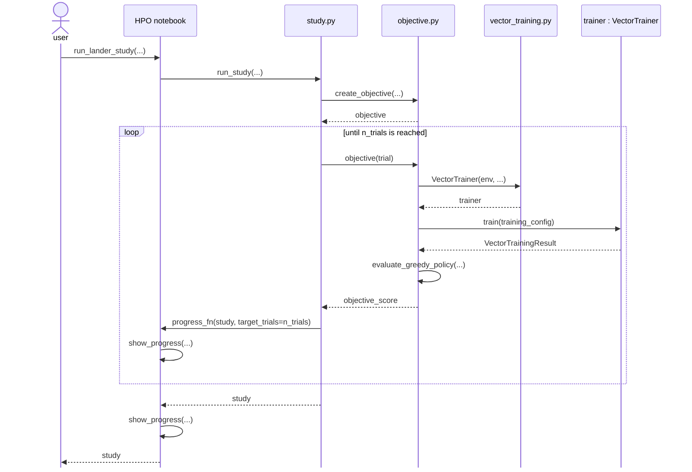

## HP4 `run_lander_study` sequence

```mermaid
%%{init: {"sequence": {"mirrorActors": false}}}%%
sequenceDiagram
    actor user
    participant notebook as HPO notebook
    participant study as study.py
    participant objective as objective.py
    participant vector_training as vector_training.py
    participant trainer as trainer : VectorTrainer

    user->>notebook: run_lander_study(...)
    notebook->>study: run_study(...)
    study->>objective: create_objective(...)
    objective-->>study: objective

    loop until n_trials is reached
        study->>objective: objective(trial)
        objective->>vector_training: VectorTrainer(env, ...)
        vector_training-->>objective: trainer
        objective->>trainer: train(training_config)
        trainer-->>objective: VectorTrainingResult
        objective->>objective: evaluate_greedy_policy(...)
        objective-->>study: objective_score
        study->>notebook: progress_fn(study, target_trials=n_trials)
        notebook->>notebook: show_progress(...)
    end

    study-->>notebook: study
    notebook->>notebook: show_progress(...)
    notebook-->>user: study
```
