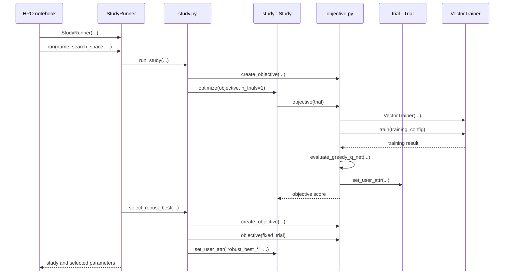

```mermaid
%%{init: {"sequence": {"mirrorActors": false}}}%%
sequenceDiagram
    participant notebook as HPO notebook
    participant runner as StudyRunner
    participant study_module as study.py
    participant study as study : Study
    participant objective as objective.py
    participant trial as trial : Trial
    participant trainer as VectorTrainer

    notebook->>runner: StudyRunner(...)
    notebook->>runner: run(name, search_space, ...)
    runner->>study_module: run_study(...)
    study_module->>objective: create_objective(...)

    study_module->>study: optimize(objective, n_trials=1)
    study->>objective: objective(trial)
    objective->>trainer: VectorTrainer(...)
    objective->>trainer: train(training_config)
    trainer-->>objective: training result
    objective->>objective: evaluate_greedy_q_net(...)
    objective->>trial: set_user_attr(...)
    objective-->>study: objective score

    runner->>study_module: select_robust_best(...)
    study_module->>objective: create_objective(...)
    study_module->>objective: objective(fixed_trial)
    study_module->>study: set_user_attr("robust_best_*", ...)

    runner-->>notebook: study and selected parameters

```
