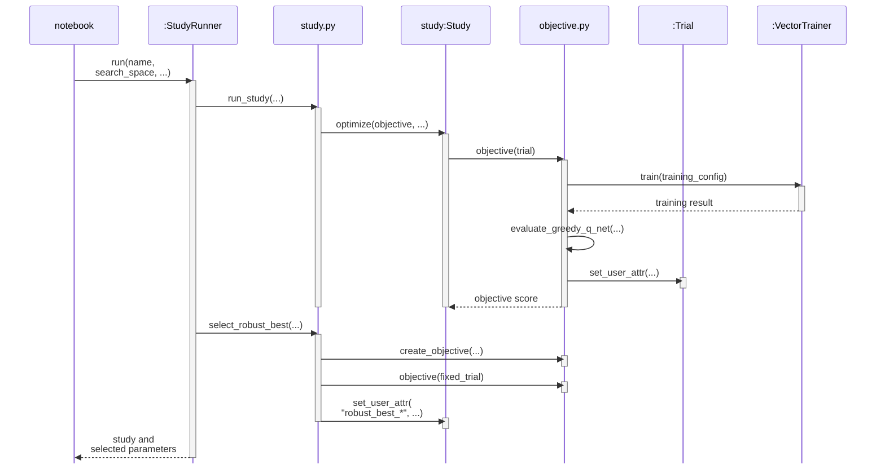

```mermaid
%%{init: {"sequence": {"mirrorActors": false}}}%%
sequenceDiagram
    participant notebook as notebook
    participant runner as :StudyRunner
    participant study_module as study.py
    participant study as study:Study
    participant objective as objective.py
    participant trial as :Trial
    participant trainer as :VectorTrainer

    notebook->>runner: run(name, <br/>search_space, ...)
    activate runner
    runner->>study_module: run_study(...)
    activate study_module

    study_module->>study: optimize(objective, ...)
    activate study
    study->>objective: objective(trial)
    activate objective
    objective->>trainer: train(training_config)
    activate trainer
    trainer-->>objective: training result
    deactivate trainer
    objective->>objective: evaluate_greedy_q_net(...)
    objective->>trial: set_user_attr(...)
    activate trial
    deactivate trial
    objective-->>study: objective score
    deactivate objective
    deactivate study
    deactivate study_module

    runner->>study_module: select_robust_best(...)
    activate study_module
    study_module->>objective: create_objective(...)
    activate objective
    deactivate objective
    study_module->>objective: objective(fixed_trial)
    activate objective
    deactivate objective
    study_module->>study: set_user_attr(<br/>"robust_best_*", ...)
    activate study
    deactivate study
    deactivate study_module

    runner-->>notebook: study and <br/>selected parameters
    deactivate runner

```
