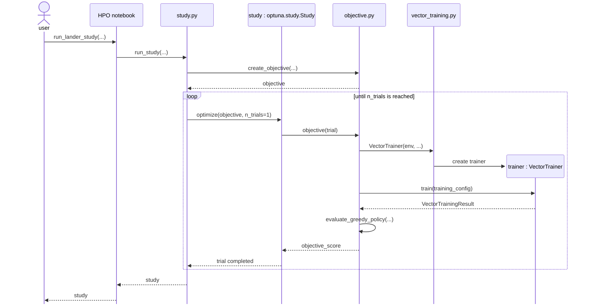

## HP4 `run_lander_study` sequence

```mermaid
%%{init: {"sequence": {"mirrorActors": false}}}%%
sequenceDiagram
    actor user
    participant notebook as HPO notebook
    participant study_module as study.py
    participant study as study : optuna.study.Study
    participant objective as objective.py
    participant vector_training as vector_training.py

    user->>notebook: run_lander_study(...)
    notebook->>study_module: run_study(...)
    study_module->>objective: create_objective(...)
    objective-->>study_module: objective

    loop until n_trials is reached
        study_module->>study: optimize(objective, n_trials=1)
        study->>objective: objective(trial)
        objective->>vector_training: VectorTrainer(env, ...)
        create participant trainer as trainer : VectorTrainer
        vector_training->>trainer: create trainer
        objective->>trainer: train(training_config)
        trainer-->>objective: VectorTrainingResult
        objective->>objective: evaluate_greedy_policy(...)
        objective-->>study: objective_score
        study-->>study_module: trial completed
    end

    study_module-->>notebook: study
    notebook-->>user: study
```
